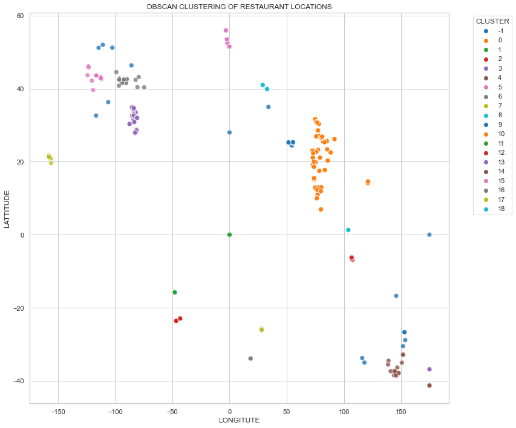

<html>
  <body>
    <h1> # Task3_L2: GEOGRAPHIC-ANALYSIS</h1>

🚀I'm excited to share my Task-3 (Level 2): GEOGRAPHIC-ANALYSIS in the Data Analysis Internship Program with Cognifyz Technologies!

<h2>🔹Project Overview:</h2>

In this project, I analyzed a given restaurant dataset to explore insights on:
1. Identify the most common combinations of cuisines in the dataset and
2. Determine if certain cuisines combinations tend to have higher ratings.

<h2>🔹 Key Insights: </h2>
After performing a thorough analysis, here are the findings: 
<h2>DBSCAN Clustering of Restaurant Locations</h2>

   
This scatter plot shows restaurant clusters based on locations, with:
- X-axis: Longitude
- Y-axis: Latitude
- Colored dots: DBSCAN cluster labels (0-18)
- Gray dots (-1): Noise or outliers (restaurants not in any cluster)
Each cluster groups restaurants that are geographically close."

<h2>🛠️Tools & Technologies Used:</h2> 

To achieve this Task3 of level 2, I used the following tools and technologies: 

1. Python – used as a programming language for data analysis
2. NumPy – used for efficient numerical computations
3. Pandas – used for data cleaning, manipulation, and analysis
4. Matplotlib – used for creating visualizations like charts and plots
5. Seaborn – used for advanced statistical data visualization
6. Jupyter Notebook (Primary IDE) - used for writing and executing code.

These tools enabled me to effectively extract insights and meaning from the data.  
🎉 I'm grateful for the opportunity to work on this project and sharpen my data analysis skills.  Thank you to Cognifyz Technologies for this amazing learning experience! I'm excited to continue growing and taking on new challenges.  
Explore the full project on LinkedIn and GitHub: 
▶️ [(https://www.linkedin.com/feed/update/urn:li:activity:7316539760322191360/) ](https://www.linkedin.com/feed/update/urn:li:activity:7317217856398446592/) 

I hope this will be very helpful to new learners and students.  
And I'd love to hear your thoughts and feedback!  
Let's connect and explore more data-driven insights together.   
Thank you all!

  <b>(YUMNAM PREMKUMAR SINGH)</b>

</body>
</html>
